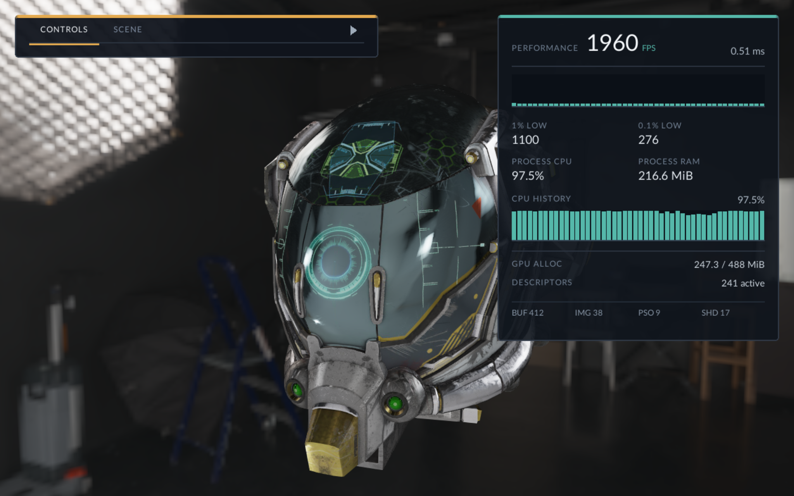

# VULDIR



## Build Status

[](https://github.com/kikijiki/Vuldir/actions/workflows/build.yml)

## What is Vuldir?

Vuldir is a small rendering library with a shared API over Vulkan 1.3 and
DirectX 12. Resource management, math, and PNG, HDR, JSON, and glTF loading are
in-tree. The sample and tests fetch pinned external dependencies through CMake.

It is a learning renderer, not a production engine. The sample loads glTF scenes
and runs the same renderer on both APIs.

## Build

Supported configurations combine:

- Vulkan 1.3 or DirectX 12.
- Windows or Linux for Vulkan; Windows for native DirectX 12.
- Ninja or Visual Studio 2022.
- Debug, Release, or ASAN where provided by the presets.

### Nix development shells

```bash
nix develop          # Vulkan / Linux; also loaded by .envrc
nix develop .#dx12   # MinGW + Wine + vkd3d-proton + DXVK on x86_64 Linux
```

The DX12 shell creates and maintains `.wine-dx12`, including vkd3d-proton's
`d3d12`/`d3d12core` and DXVK's `dxgi`. The recipes can be run from either shell:

```bash
just build-vk && just run-vk
just test-vk
just build-dx && just run-dx
just smoke-dx
```

Native DX12 Linux builds are not supported; `build-dx` cross-compiles the
Windows executable with MinGW and `run-dx` executes it through Wine. Translation
layer behavior can differ from native Windows, and RenderDoc capture through
Wine is best-effort.

## Sample debug UI

The sample has an RmlUi panel for camera, lighting, tonemapping, and G-buffer
inspection. RmlUi is pinned to 6.1 and built only for the sample; CMake stages
the UI documents and font next to the executable.

UI geometry is rasterized on the CPU into an RGBA8 overlay and blended onto the
swapchain. It is a debugging UI, not a GPU RmlUi renderer.

## Architecture

A common resource and command API has Vulkan and DX12 backends. Pipelines share
the bindless shader layout in
[`Layout.hlsli`](src/shaders/vuldir/Layout.hlsli). Device-owned descriptor heaps,
resource views, and samplers provide stable bindless indices; reuse is deferred
until active frame contexts retire.

Each `RenderContext` owns a frame ring of command pools and command buffers for
graphics, compute, and copy queues. Command buffers track virtual resource
states while recording and atomically publish them after successful submission.
Shared device queues and allocation structures are synchronized so independent
contexts can record and submit concurrently.

Vulkan uses dynamic rendering rather than render-pass/framebuffer objects. The
API deliberately omits backend-specific binding models such as DX12 root
descriptors and Vulkan combined image samplers.

Details are in [`ARCHITECTURE.md`](docs/ARCHITECTURE.md).
